**Programming Boot Camp**

# Bubble Basics

**Institute of SCIENCE TOKYO 2025/10/25**
　
　
　
　
　
　　　　　　　　　　　　　　　　　　　　　**Naotake KYOGOKU**

---

## Table of Contents

- What is Bubble?
- First, let's create a user registration screen using the sign-up components
- Overview of App Development with Bubble
- Let's Build User Registration and Login Features
- Learn Databases: Build a System from Pet Registration to List Display
- Let's Create Common Components Across Screens
- Integrating with External Systems
- Introduction to AI Features
- Summary

---

## What is Bubble?

- [Bubble](https://bubble.io/) is a visual programming tool. While it is a no-code tool, it requires a programming mindset.
- Selecting desired components from the available parts and dragging and dropping them onto the screen is intuitive and straightforward.
- However, adding interactions to placed components requires a programming mindset.
- Apps developed in Bubble are built as web applications and then adapted for mobile display.

---

Examples of Apps Built with Bubble

- Aihome Virtual Showroom: ※The site shut down
  - Property Online Viewing App
  - An app enabling online property viewings in a Street View-like format.
  - [Reference](https://note.com/apopopo/n/n155b0df7f78c): Focuses more on no-code development insights than Bubble-specific know-how
- Overseas Study Destination Search Platform: https://app.unipassport.jp/
- There are many more examples, so try searching for "Bubble case studies"!

---

### Sign Up for Bubble

- From the Bubble homepage, enter your email address to register an account
  - https://bubble.io/
  - Click "Get started"


---

- You can register for an account for free
- Enter your email address and a password of your choice, then click "Start building"


---

- When asked where you heard about Bubble, select "Friend or colleague"


---

- When asked how you plan to use Bubble, select "Build"


---

- You will be asked whether to build the app as a web app or a mobile app, so select "Web".


---

- You may be asked if you want to create an app using AI features, but since this tutorial focuses on teaching you how to use Bubble, we'll proceed without using them.
- Therefore, select the "skip and take me to the editor" option at the very bottom.


---

- You will be asked which plan to use last
- Since we'll be using the free plan this time, select "Start with basic features" below


---

- Then, the screen should switch to display what looks like a white editing screen.
- This is Bubble's main screen.


----

- Additionally, a confirmation email will be sent to the email address you entered. Please check your inbox.
- Look for an email from Bubble with the subject line "Verify Your Bubble Account." Click the link in the email body that says "Click here to confirm your email address."


---

- If the Bubble screen appears and displays "Thanks for confirming!", that's OK.


---

### Let's get started by running a Bubble template

- Click the Preview icon in the top-right corner of the screen


---

- The preview screen will open in a separate tab.
- However, only a blank white screen will be displayed.
- This is normal since no objects have been placed on the blank canvas yet :+1:

---

- I'm eager to see some action, so let's create a sign-up screen right away and test it out.
- While Bubble doesn't provide pre-made "screens" for common sign-up/login flows, it does offer "components" for them.
- I'll use those components to build a sign-up screen.
- :warning: Actual sign-up and login functionality will be developed later; for now, this is just a paper theater.

---

## First, let's create a user registration screen using the sign-up components

- :warning: We'll be interacting with various screen components, but explanations for each part will follow later
- First, we'll cover the essential components and build the user registration screen

---

### Three Main Operations

- In Bubble, you'll primarily use these three operations
- They may be hard to distinguish without labels, but from top to bottom, they are these three
  1. Design
  2. Workflow
  3. Data


---

- You can navigate between each section using the left menu.


---

#### Design

- I'll explain Design first
- A mode for placing components on the screen to create the user interface
- The left panel contains UI components, while the right panel is the actual screen editing area


---

- Let's get started on creating the user registration screen!


---

- First, place the standard sign-up components provided by Bubble
- Click the "Components" icon in the upper-right corner of the screen


---

- Then, an area labeled `Components` (UI Components) should appear on the right side of the screen.
- This is literally a list of common components provided by Bubble.


---

- Open the Inputs & forms category toward the bottom of this area, then drag and drop the Sign up component with an image into the Drawing area.
- ※ Before dragging and dropping, change the Layout of the index page to `Container layout: Column`.


---

- I imagine it was positioned to fit snugly at the top of the screen like this.


---

- Let's preview it here
- I believe the Sign Up component is displayed successfully


---

- Within this component, there is a link labeled `Already have an account?` below the Sign up button. The UI makes it appear as though it leads to a login screen, but since we haven't prepared a login screen yet, clicking the link currently does nothing.


---

- So next, we'll prepare the login screen.


---

- Click the `🏠 index` in the top-left corner of the screen to display a popup
- Click `+ New` in the popup, then click `Web page`


---

By the way...

- This shows a list of "pages" and "shared components" currently in the application you're building.
- In Bubble, you work on one screen at a time within a single canvas.
- So remember: you'll need to make changes here to navigate between screens :raising_hand:

---

- Clicking `Web page` under New will open a popup for a new screen.
- `Page name` is the screen's name, so enter it using only alphanumeric characters without spaces.
  - Let's use `login` for this one.


---

- `Clone from` allows you to select a source screen when you want to create a similar screen, enabling you to make a copy of that screen.


---

- For example, since the registration screen and edit screen share nearly identical screen elements, selecting the registration screen in the "Clone from" option when creating the edit screen after building the registration screen reduces development effort.


---

- Leave it unselected for now
- Click the "CREATE" button


---

- Once the new screen is created, first align its "Layout" with the user registration screen.
- Specific details will be omitted in this session, but you can specify the relative positions of components placed on the screen on a per-page basis.

----

- Click near the center of the screen to display the advanced settings dialog.
  - We will be interacting with this advanced settings dialog in various places going forward.
- This time, from the Layout tab:
  - Container layout: `Column`
  - Container alignment: Top-aligned icon


---

- Once you've completed the above settings, drag the image-based Log in component from Components using the same procedure as before.
- As before, it should be positioned to fit snugly at the top of the screen.


---

- Next, let's set up the links so you can navigate between the login screen and the user registration screen, which weren't working earlier.

---

- Click the text that looks like a link labeled `Create a new account` within the login component


----

- When the `Create a new account` dialog appears, open the "Appearance" tab
- Select `index` from the `Destination page` dropdown within it
- This sets the user registration page `index` as the destination page when this link is clicked


---

- For the same capacity, please configure the link destination so that users can navigate from the registration screen to the login screen.

# :hourglass_flowing_sand:
# :hourglass:

---

**Answer Check :memo:**

- Select `index` from the top left to open the Sign up page
- Click the `Already have an account?` link within the Sign up component


---

- When the `Link Already have an account` dialog appears, select `login` from the `Destination page` dropdown.


---

- Once you've gotten this far, preview your app and make sure you can navigate between the login screen and the user registration screen!

---

- At this point, clicking the "Sign Up" or "Log In" buttons won't do anything yet.
- That's because you haven't told Bubble what action to perform when these buttons are clicked.
- We'll cover this setup later, so let's move on for now 🙋‍♀️

---

#### Here's a quick coffee break :coffee:

About Mobile Responsiveness

- As mentioned at the beginning, Bubble apps are fundamentally web applications.
- To make a Bubble app mobile-responsive, we incorporate the concept of **responsive design**.

---

- First, let's see how it works.
- Try shrinking your browser window.

https://matsushitahome.com/

---

- The layout doesn't break; elements automatically rearrange themselves to fit smartphone sizes.
- This is what responsive design is all about.
- Google explains it this way.

```
Regardless of the user's device type (desktop, tablet, mobile, non-visual browser),
the same HTML code is delivered via the same URL, while the rendering method is adjusted according to the screen size.
```

参考資料
https://developers.google.com/search/mobile-sites/mobile-seo/?hl=ja

---

Key points are as follows:
1. The URL of the displayed page remains the same
2. Automatically adjusts the rendering method based on screen size

---

- To put it more simply, it controls whether elements expand/contract, wrap/don't wrap, or display/hide based on screen size.
- By configuring this at the individual item level, you can automatically enable responsive design.
  - During actual development, I recommend setting it up, previewing, and testing the behavior.
- We plan to cover making Bubble applications responsive in the second Bubble lecture.す🙋‍♀️

---

## Overview of App Development with Bubble

Now, let's go over the basics of app development with Bubble.

---

### The Three Main Operations

- Let's look at the remaining two operations.
  1. Design
  2. Workflow
  3. Data


---

#### Workflow

- Modes for adding motion to the screen
  - Example: Transitioning screens when a button is pressed
  - Example: Manipulating data when a button is pressed
- This is where a bit of programming thinking comes into play.


---

#### Data

- A mode for defining or manipulating data
- We'll cover explanations about the data (database descriptions) later


---

- Select the "App data" tab and click the "All Users" link
- The right panel will then display data for all registered users. Since you haven't implemented the sign-up feature yet, the user count should still be 0.


---

#### Other Operations

We'll also briefly explain other operations (menus).

---

#### Styles

- By naming styles, they can be used universally throughout the application (while also allowing individual specification per component)


---

#### Plugins

- Various components for extending applications are available worldwide.
- Bubble refers to these as "plugins."
  - For example, various plugins for drawing line charts.
  - For example, plugins for connecting Bubble applications with ChatGPT.
- Bubble plugins include both free and paid options, so be sure to check before using them.

---

#### Settings

- Bubble plan changes and account management
- Not covered in this lecture

---

- By the way, you can centrally manage messages provided by Bubble in Settings > Languages
  - Allows changing the locale (language settings) for the main user of the application
  - Modifying these messages enables unified message management across the entire system
  - You can change messages used consistently throughout the app and alter default messages
  - You can also add app-specific messages
- This topic will not be covered in this lecture

---

#### Logs

- You can view logs when running the application
- You can also view logs while previewing the application
- This will not be covered in this lecture

---

#### The overall picture of the screen we're about to build


---

## Let's Build User Registration and Login Features

- Now that we've completed the front-end development for user registration and login, let's build the actual user registration functionality.
- Before that, let's create the base screen for successful registration and login transitions so users can visually confirm these actions.
- For now, create a new screen named `pet_list` from the top-left menu.
  - It's fine to leave it empty for now.

---

Now let's build the user registration feature.
- What we need to do:
  - When the Sign Up button is clicked
  - Register the entered "Name," "Email Address," and "Password" as user information.

---

#### Let's get started right away!

---

### When you press the Sign Up button

- In Bubble, all actions are configured through the Workflow tab
- While you can start configuring directly from the Workflow tab, this time we'll set up the workflow starting from the button that triggers the action

---

- Open the index page
- Click the `Sign up` button in the Sign up section
- Click the `Add workflow` section in the displayed dialog


---

- Then, the screen should switch to the Workflow.
- As explained earlier, the Workflow is where we add the actual actions. So, we'll add the action to register user data when the `Sign up` button is clicked.


---

- The `Button Sign Up is clicked` item is likely selected
- This is where you configure what action to execute when the "Sign up" button is clicked


---

- You should see a `+` button below. Click it to configure the behavior when the Sign up button is clicked.


---

- Clicking `+` displays a popup where you can specify various actions
- Since this involves user actions, select the topmost `Account` option


---

- Then, additional sub-elements should appear. From those, click `Sign the user up`.
- Literally, this is the behavior setting for user sign-up.


---

- You should then see the "Sign the user up" dialog, so let's proceed with the setup.
- The required fields for "Email address" and "Password"—which are essential for login—are displayed here.
- This means we'll now configure the settings for Email and Password.


---

- First, click the `Click` button to the right of Email, and a dropdown menu should appear.
- This displays all elements (items) currently present on the open index page as candidates.


---

- In this case, the value set for Email will be the value entered in the Email input form.
- If you look for a relevant item, you'll find an `Input Email (Sign up)` element within the `ELEMENTS` block. Hovering your mouse over it will show you how the actual element appears.


---

- Clicking `Input Email (Sign up)` displays an additional dropdown menu
- Since we need the `value itself` entered into this `Input Email` form, select `'s value`
- The other options, `is valid` and `isn't valid`, are used when you want to utilize the result of checking whether the entered value is correct


---

This means that the user's Email field will be set to the value entered in the `Input Email` form on the screen.


---

- Using the same method, please configure settings to save your password and username.

# :hourglass_flowing_sand:
# :hourglass:


---

- Regarding the "Username" field, since there is currently no such column in the user table, it must be created.
- From `Change another field`, you can configure settings for fields other than Email and Password.

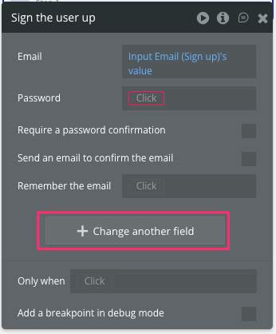

---

- Since the username does not yet exist, click `Create a new field...` and add a field to save the username from there
- Let's name it `name`

# :hourglass_flowing_sand:
# :hourglass:


---

- Did you manage to set it up?
- I think it should look something like this

- Now, when you click the Sign Up button, it should register the user data using the information entered on the screen


---

- Now, to verify functionality, press the `+` button again under the `Sign the user up` step you just set up in Step 1 to select a screen transition action.
- What should we choose here?


---

# :thinking:
# :thinking::thinking:
# :thinking::thinking::thinking:
# :thinking::thinking::thinking::thinking:

---

- Yes, click `Navigation` --> `Go to page...`
- Then, select `pet_list` as the destination in the dialog that appears, and you're all set.

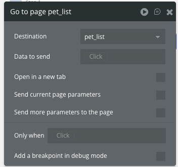

---

- Let's preview it
- Key points to verify:
  - After entering required fields and clicking the Sign up button, the page transitions to a blank pet_list screen
  - User information is registered in the database upon clicking the Sign up button
    - Since passwords cannot be viewed, confirm that the email address and username are saved correctly

---


---

- You may have noticed that on this sign-up screen, despite having two password fields to prevent incorrect passwords, entering different values in the first and second fields currently still allows account registration to succeed using the first field's content.
- Since this defeats the purpose, please modify it so that registration fails if the contents of the `Password` and `Re-enter password` fields differ.

# :hourglass_flowing_sand:
# :hourglass:

---

**Answer Check :memo:**


---

Alright, let's move on to setting up the login workflow! 🙋‍♀️

---

- The approach is the same as for Sign up, so please think it through and set it up yourselves!

# :hourglass_flowing_sand:
# :hourglass:

---

- First, display the login page, which is the sign-up screen
- Click the `Log In` button, then click `Add workflow` from the dialog

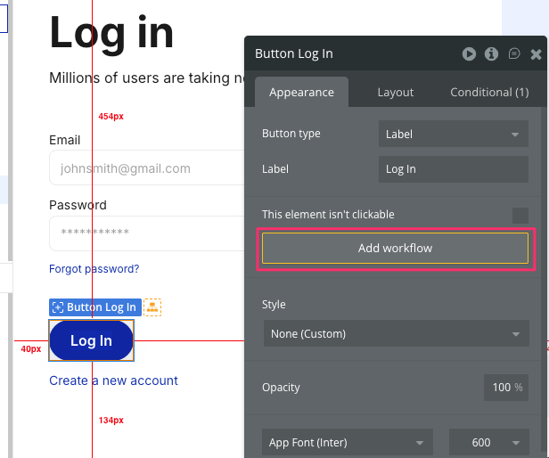

---

- The Workflow screen will appear. Select the actions required for the login process from the `+` below the selected `Button Log In is clicked`.


---

- In this case, it's the `Log the user in` action for the `Account`.
- From the displayed dialog, specify the values to be used as the email address and password, which are the items required for login authentication.


---

- As with the sign-up process, there should be fields for entering your email address and password among the options, so select the `'s value` for each field.


---

- Once configured, add an action to navigate to the `pet_list` screen after login, similar to the sign-up process.

---

- Once you've completed these settings, let's test the login functionality.
- Log in using the account information you registered during signup and verify that you are redirected to the pet list screen.


---

## Learn Databases: Build a System from Pet Registration to List Display

- Now that we've implemented user management, let's build the pet management functionality.
- First, we'll prepare the database for pet information.
- Then, we'll create the pet registration screen and build the system to display those pets in a list.

---

### Learning About Databases

- In app development, organizing the data your app will handle helps smooth the development process later on.
- First, let's confirm what a database actually is.

---

### What is a Database?

- An organized collection of data
- You can use a database to register (Create), display (Read), update (Update), and delete (Delete) data
- These operations are collectively referred to as CRUD

---

- Fundamental elements for learning databases
  - Table
  - Field
  - Record
  - Relation

---

- Table
  - It's like a "table" for storing data. For example, if there's a table called "Students," all student information is stored within it.
- Field
  - This corresponds to a "column" in a table. It represents one type of information. For example, "Name" or "Age" are fields.

- Record
  - Corresponds to the "rows" in a table. It is a collection of individual fields. For example, the information for one student—such as their "Name," "Age," and "Address"—forms one record.

---

To summarize up to this point, a table can represent a collection of information, a field represents the type of that information, and a record represents a single set of specific data.

---

- Databases are often likened to "something like spreadsheet software."


---

- Applying the table, fields, and records from earlier to a spreadsheet would look something like this:


- It just... fits, right? :sunglasses:

---

When learning about databases, there is another important concept.

- Relation
  - A mechanism that connects multiple tables to associate data
  - Tables within a database can not only operate independently but also be linked to other tables
  - For example, if there are "Student" and "Class" tables, these two tables can be connected via a relation so that one student can participate in multiple classes
  - This allows easy management of which classes a student belongs to, and conversely, which students are enrolled in a class

---

There are primarily three types of relationships:

- One-to-one relationships
- One-to-many relationships
- Many-to-many relationships

---

#### One-to-One Relationship

- The "Student" table and the "Student ID" table
- One student has only one student ID, and one student ID corresponds to only one student
- One student has one student ID

---

#### One-to-Many Relationship

- The "Teacher" table and the "Class" table
- One teacher may be assigned to multiple classes, but each class has only one teacher
- One teacher may be assigned to multiple classes

---

#### Many-to-many relationship

- The "Students" table and the "Classes" table
- One student can participate in multiple classes, and one class can have multiple students enrolled
- Multiple students can be enrolled in multiple classes

---

- That concludes the explanation about the database 🙋‍♀️

- Just listening might not give you a clear picture, so let's organize and design the database fields needed while looking at the screens of the application we'll develop in this lecture.
- The next pages show the planned screen images and the database design steps.

---

#### Sign-up screen


---

#### Login screen


---

#### Pet List Screen


---

#### Pet Registration Screen


---

#### Pet Details Screen

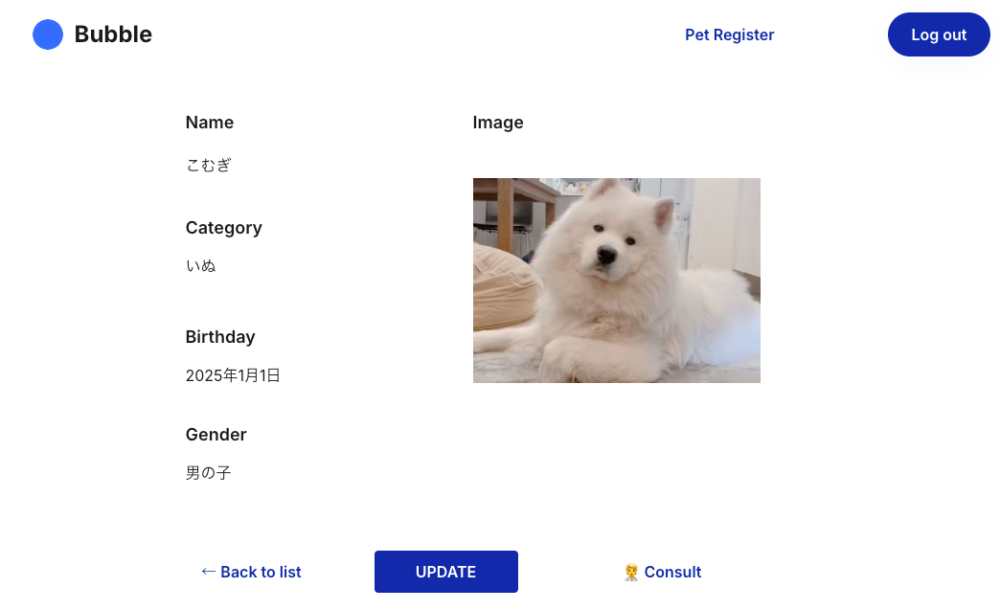

---

#### Pet Edit Screen


----

Database Design Procedure

1.  While viewing the screen, list the data that needs to be saved and write it down in a text editor or similar tool.
2.  Consider how the listed data can be categorized into tables.
3.  Add the data listed in step 1 as appropriate fields in the tables.
    When doing so, also specify the field type.
4.  For items requiring relationships, add fields representing those relationships as well.

---

※Explanations follow on the next slide, but please try to figure it out yourself before looking at the answer :eyes:
※There's no single correct answer. If you're stuck, go with your gut :brain:

---

### Explanation

- Listing the data that needs to be saved while viewing the screen resulted in the following:

```
- User name: string
- User email address: string
- User password: string
- Pet name: string
- Pet type: string
- Pet birthday: string?
- Pet photo: image?
- Pet gender: string
- User owning the pet: user?
```

- If anyone has other data to add, please let me know!

---

- Considering how the listed data can be categorized into tables, I'll classify it into these two groups this time.
```
- User
- Pet
```

---

Additional Notes on Table Classification

- When the relationship "If A is determined, B is uniquely determined" holds true, A is often classified as a table, and B as a field within that table. For example:
  - If a user is determined, their name, email address, and password are each uniquely determined
  - If a pet is determined, its name, breed, birthday, photo, and gender are each uniquely determined
    - The pet photo might still be up for discussion :dog::camera:

---

- When the relationship "multiple Bs exist for each A" holds true, it's advisable to split A and B into separate tables.
  - For example, a pet might have multiple photos associated with it :camera:
  - That's not incorrect either!
  - For this lecture, we'll assume you can only set one favorite photo per pet and treat it as a single field within the pet table :dog:

---

- Once we've decided on this much, we'll stop organizing the database for now and create specific tables only when they're actually needed.
- Creating all tables upfront is also an option.
- However, as we build screens and features, the organized database content often gets refined and changes.
- If everything is created initially, there's a risk of backtracking when such changes occur, so keep that in mind.

---

#### Creating the Pet Registration Screen

- Now that the database is organized, we'll create the pet registration screen.
- From the `Add a new page...` option in the upper left, create a new screen named `pet_register`.


---

#### Assemble the Pet Registration Screen

- Let's create the pet registration screen using the screen image as a reference.


---

#### Pet Name

- First, place a text box for entering the pet's name
- From the left panel's "UI Builder," select `Input` under `Input forms`
- Then click where you want it placed in the right panel to display the input field


---

- Double-clicking an element displays a dialog where you can configure various settings for that element. Proceed to configure the necessary items.
- `Placeholder` is the auxiliary text displayed when the text box is empty.
  - For this example, set it to "pet name".


---

- `Content format` allows you to specify the format of values that can be entered into the text box
  - Since this time it will be string input, leave it as "Text"


---

- `This input should not be empty` allows you to specify whether the input is required
  - Since we want it to be required this time, we'll check the box


---

- Clicking the top part of the dialog allows you to name this text box element
- This will be useful later when defining the workflow, so let's specify it as "Input pet name" here


---

- Once you've set things up to this point, you're good to go.
  - There are other detailed settings available, but we'll skip explaining them here.
  - If you're curious, feel free to take a look :mag:

---

#### Pet Type

- Next, place the element for entering the pet type
- As before, select the `Input` form from the left panel and drag it onto the right panel to place the element

---

- Double-click this element to configure its properties.
  - Enter "pet category" in the `Placeholder` field.
  - Specify "Input pet category" as the element name.
  - Check the box for `This input should not be empty` to make it required.


---

#### Pet Image

- Next, place the element for uploading pet images
- Select `Picture Uploader` from the left panel and drag it onto the right panel to place the element

---

- Double-click this element to configure its properties.
  - Enter "Click to upload pet image" in the `Placeholder` field.
  - Specify "Input pet image" as the element name.
  - Check the box next to `This input should not be empty` to make it required.


---

#### Pet's Birthday

- Next, place the element for entering the pet's birthday
- Select `Date/Time Picker` from the left panel and drag it onto the right panel to place the element

---

- Double-click this element to configure its details
  - Selecting `Date` for `Input type` restricts input to dates only
    - Selecting `Date & Time` here enables input of both date and time
    - For this example, we'll use `Date`


---

- Check the box for `This input should not be empty` to make it required
- Specify `Input pet birthday` as the element name


----

#### Pet Gender

- Finally, place the element for selecting the pet's gender
- Select `Dropdown` from the left panel and click on the right panel to place the element

---

- Double-click this element to configure its details
  - Enter "pet gender" in the `Placeholder` field
  - Enter "Male" in the `Choices` field, press Enter to create a new line, then enter "Female" on the next line

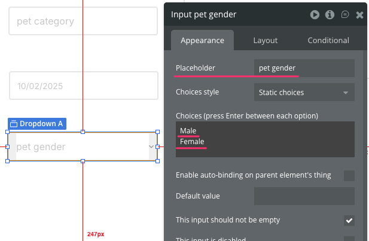

---

- Check the box for `This input should not be empty` to make it required
- Specify `Input pet gender` as the element name


---

#### Register Button

- Once you've entered all the pet information up to this point, place the Register button.
- Select the `Button` within `Visual elements` in the left panel, then click in the right panel to place the element.

---

- Double-click this element to configure its details.
  - Edit the section labeled "...edit me..." at the top of the Appearance tab and enter "REGISTER".

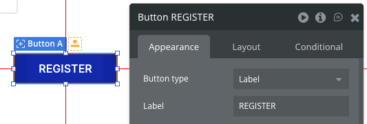

---

#### Label each input element

- Since individual input fields alone make it difficult to identify what each form is for, place a label in the top-left corner of each element for identification
- Select `Text` from the `Visual elements` section in the left panel, then drag and drop it onto the right panel to position the element

---

- When placing elements, ensure their height is at least 30px.
  - Otherwise, the element's contents won't display correctly!
  - You can also edit the `H` value from the Layout tab in the Details dialog after placing the element!


---

- Configure the element details here as well
  - Edit the section labeled "...edit me..." at the top of the Appearance tab and enter "Name"
  - Select `Heading 6` for the `Style` option in the middle section of the dialog


---

- Try adding other labels using the same method.
  - Category
  - Image
  - Birthday
  - Gender


---

- You can follow the same steps, but copying and reusing the Name label you created earlier saves time.
  - Copy (Ctrl + C) and paste (Ctrl + P), then just rewrite the label's contents.
  - On a Mac, use Copy (Command + C) and Paste (Command + P).


---

- Finally, set the width of all elements except pet images to 250px.
- Set the `W` (Width) value to 250 in the dialog that appears when double-clicking each element.
- Also set the `X` (horizontal position) value to a suitable value (e.g., 200).
  - This is to improve visual appearance.
  - Since pet images are displayed in two columns, adjust the `X` value appropriately.

---

- You can change them one by one, but since there are many elements, let's change them all at once.
- With all elements selected, right-click on any one element.
- From the submenu that appears, select Edit.

---

- A dialog will appear; verify that the number of selected elements matches the number of changed elements.
- If everything looks correct, open the Layout tab within the dialog and click the `W` (Width) section.


---

- This allows you to set a uniform width (W) and height for the selected element, so enter 250 for `W` and 200 for `X` to complete.


---

- Once you've gotten this far, click the `Preview` button in the top-right corner to display the preview and see how it works!

---

- Are all elements displayed?


---

- Can you enter values in all input fields?
- Will it display when you specify an image?


---

### Let's connect to the database

- Now that the screen layout is complete, it's finally time to connect to the database.

---

#### First, prepare a box to store your pet's information.

- Select Data from the left menu tabs.
- Then select the Data types tab and enter "Pet" in the text box labeled `New type` below it.


---

- Then check the box for `Make this data type private by default` and click the `Create` button.


---

- Add the fields you organized earlier to the type of the Pet you created
- Select `Pet` from `Data types`
- Click `Create a new field` under `Fields for type Pet` on the right


---

- A pop-up window will appear; enter the required information.


---

- Enter the element name in the `Field name` field.


---

- Select the element type (text, number, date, etc.) for `Field type`.


---

##### Now let's add the required fields to the Pet type.

Let's set up the items we considered earlier in the database design!

# :hourglass_flowing_sand:
# :hourglass:

---

Something like this, I guess.

- Name: text
- Category: text
- Image: image
- Birthday: date
- Gender: text


---

### After clicking the registration button, you'll be able to register your pet.

- Now that the box for storing pet information is ready, we'll finally add the functionality to save it to the database when the registration button is pressed.

---

- Select the Design tab from the left menu
- Select the "pet_register" screen from the top left
- Double-click the "REGISTER" button on the pet registration screen in the right panel
- Click `Add workflow` in the "Appearance" tab


---

- Switch to the Workflow tab. You should see `Button REGISTER is clicked` displayed in the When section. Select the `+` to configure the button's behavior when clicked.


---

- Click `+`
- For actions related to databases (tables) you created yourself, like this time, select `Data(Things)`


---

- Select `Create a new thing...` from the subelements.


---

- The `Create a new thing...` dialog appears, so specify the type you want to register this time.
  - This time it's Pet, right?
- Then a button labeled `Set another field` appears. As the title suggests, you'll set the items entered on the screen as the "field" for Pet.


---

- Here, specify the "field" name of the item you want to save in Pet on the left side, and specify the actual value to save in that "field" on the right side.
  - First, select `Name` on the left side.


---

- When you specify the left side, it should appear enclosed by `=` and then `Click` will be displayed on the right side.


---

- This time, you'll specify the actual value entered in the "Pet Name" input field you set up yourself.
- I'm sure you've all mastered how to use it by now, so give it a try :wink:

---

- That's the vibe, right? :wink:


---

- Let's configure all the remaining items too!

---

- Of course, it's like this, right? :wink:


---

### Let's give it a try!

- Now that you've set everything up, let's check if the pet actually registers in the preview.
  - By the way, clicking "Ctrl + P" will show the preview (shortcut key).
- Fill in all the input fields and click the "REGISTER" button.
- Nothing will happen on the screen, but let's see if the data was actually registered.

---

- Close the preview, open the Data tab, select App data, and then select `All Pet` in the left panel to confirm that the information entered on the screen earlier has been saved.


---

- We've now reached the point where we can save the input from the screen to the database! :tada:

- Finally, just like with login, we'll add an action to navigate to `pet_list` after the database save completes.

# :hourglass_flowing_sand:
# :hourglass:

---

- Let's preview it now
- You should see the pet registration screen. Enter the pet information as before and click the "REGISTER" button
- You'll then see the screen transition to the pet list screen, confirming the pet information entered is saved to the database

- Is the pet information registered correctly? :raising_hand:

---

### Pet List Display

- Next, let's build the pet list screen.


---

#### Building the Pet List Screen

- Select `pet_list` from the page list in the upper left
- When displaying the same element repeatedly, as in this case, choose `Repeating Group` from the `Containers`
- Drag it onto the canvas in the right panel


---

- The element details popup will appear; proceed to configure it
- Enter `pet list` in the top element name field
- Specify the type of data to be displayed repeatedly in `Type of content`
  - In this case, it's `Pet`


---

- Specify the number of rows and columns in the table
- Since the number of rows should change dynamically, uncheck `Set fixed number of rows`
- Instead, specify the minimum height for a single row
  - In this case, set it to "200px"


---

- Since we want to display three images per row this time, leave the `Set fixed number of columns` checkbox ON
- Set the value for Columns to "3"


---

- To ensure the entire table has a height of two rows, select the `Layout` tab and set the `H` value to "400".
- To make the images square within each row, set the `W` value in `Layout` to "600".


---

- Also, to set the layout within each cell to a fixed layout, select `Fixed` in the `Cell's container layout` option.


---

- Next, specify the data to display in the list

- From the `Appearance` tab, click `Do a search for` under `Data source`
  - This is for specifying the data to display in the list


---

- A "Do a search for" popup will appear; specify `Pet` in the Type field
- This specifies that you want to search for a list of pets


---

- As it stands, this would display a list of all registered pets. We'll add a condition to show only the pets registered by the logged-in user.
- Click "Add a new constraint" to add another condition.

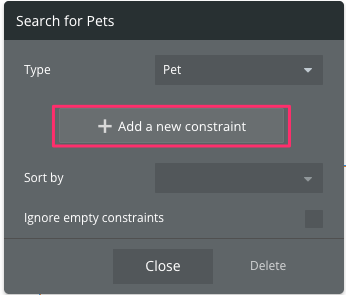

---

- The condition to set is "The pet's creator (Created By) must be the same as the 'Current User'."
- What would the setting look like? Let's think about it!

- The answer is on the next page, so take a look after you've thought about it :eyes:

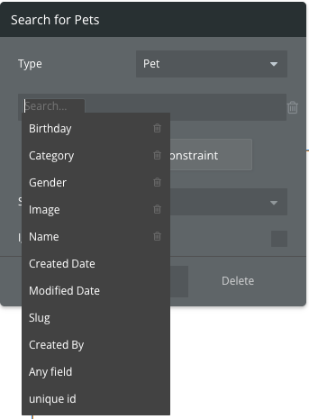

---

- That's how it looks
- The expression "A = B" appears in various situations when working with Bubble, so be sure to remember it well!

- That completes specifying the data to display in the list view


---

- Next, we'll set up the content to be displayed repeatedly
- Specifically, let's display an image and a name in each cell


---

- First, select `Image` from `Visual elements` and drag it to the right panel
  - Dragging it into the top-left cell of the "Repeating Group" you placed earlier saves you the trouble of moving it later
  - You can also add it to the Repeating Group later


---

- After placing it inside the Repeating Group, adjust the image size and position within the Repeating Group from the Layout tab.


----

- `W`: 200 / `H`: 200 / `X`: 0 / `Y`: 0
  - To fill the entire cell, the size (W/H) matches the cell size at 200 x 200
  - The position (X/Y) is also set to the top-left corner at 0, 0

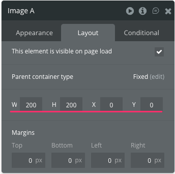

---

- Let's name the element `pet list image`.


---

- We'll now configure which image to display last
- Select "Dynamic image" from the Appearance tab
- This will display a button labeled `Insert dynamic data` (or something similar); click it
  - This feature is used when you want to display values or images dynamically, rather than fixed values or images


---

- Click to display the dropdown menu, then select `Current cell's Pet`
- This is useful when you literally want to use the pet data from the current cell


---

- Selecting `Current cell's Pet` displays an additional dropdown showing fields associated with the Pet type. Click `'s Image`.
- This creates an instruction to display the pet's image for the current cell. If multiple pet records exist, each cell will display its corresponding pet image.

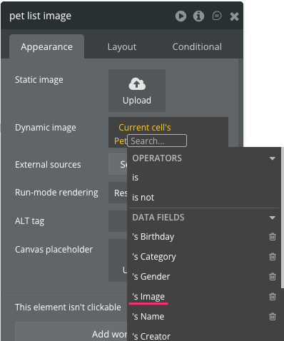

---

- I just set the image to span the full width of the cell, but let's change the `Run-mode rendering` value for the image element from "Stretch" to "Zoom".
- Otherwise, the image's aspect ratio will be automatically altered within the cell, so we'll switch to a zoomed display instead.


---

- Next, let's set the background for the name displayed below the image
- Select `Shape` from `Visual elements` and drag it to the right panel
- Drag it into the "Repeating Group" as well


---

- Set the position of this placed element in the `Layout` tab as follows:
  - `W`: 200 (same width as the image)
  - `H`: 40
  - `X`: 0
  - `Y`: 160 (to position the 40-height object at the bottom edge: 200 - 40 = 160)

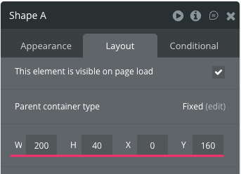

---

- Let's slightly reduce the opacity so the image shows faintly beneath the placed Shape
- Open the Appearance tab for "Shape A"
- After confirming the Style is set to "Standard," click "Edit style" below it


---

- Then, navigate to the Styles tab, and the "Standard" style editing screen for the previously selected "Shape" will appear.


---

- Selecting the Background Color option here will display a pop-up for adjusting color and opacity. Enter `20(%)` in the field to the right of "Gray 20".
- This value represents the opacity level, where 100 indicates fully opaque and 0 indicates fully transparent.


---

- Finally, display the pet's name
- Select `Text` from `Visual elements` and drag it onto the Shape you placed earlier
- Drag it into the Repeating Group as well


---

- After placing it, set it to the same size as the Shape via the Layout tab
- Name the element `pet list name`


---

- Similar to pet images, pet names also use Dynamic data
- Clicking the `...edit me...` section will display `Insert dynamic data`, just like with images. From there, try setting "the pet name in the current cell".


---

- Select `Current cell's Pet` --> `'s Name`
- This completes the configuration of what to display in the list.


---

#### Once you've gotten this far, let's preview it.

- Are the pet images and names displayed as a list of pets?


---

##### Exercise 1

Let's center the pet's name and make the text a bit larger.


---

- Hint :bulb:
  - Create a new "Style" and set it to "pet list name"


---

#### Let's add a navigation path from the pet list to the registration screen

- Now that the pet list screen is complete, let's add a navigation path from the list screen to the registration screen
- We'll place this navigation path at the top of the pet list screen


---

- If you've learned with "Sign up" / "Log in," you should be able to set it up right away!
- Let's set it up!

---

- It looks like this
- The link name is "PET REGISTER"
- Select "pet_register" as the `Destination page`


---

#### Let's preview it!

- Did you click the "PET REGISTER" link at the top of the pet list to navigate to the pet registration screen?


---

## Let's Create the Pet Details Screen

- Next, we'll create the pet details screen.
- The key point here is the part where we pass the information for the pet selected on the list screen.


---

### First, create a new detail page

- Select "Add a new page..." from the top-left
- Set "Page name" to `pet_detail`
- Choose `pet_register` for "Clone from" since the layout is similar


---

- If you leave it as a clone (copy), it will end up looking exactly like the registration screen, so we'll review it.


---

- First, delete all input elements prepared as input fields.


---

- Additionally, delete the settings for when the REGISTER button is pressed from the Workflow tab.
- Right-click the REGISTER button's workflow in the left tree, then delete it by selecting "Delete workflow."


---

- Next, we'll place the display elements
- Try dragging each element from "Visual elements"
  - Name: Text
  - Category: Text
  - Image: Image
  - Birthday: Text
  - Gender: Text


---

- Set the width (w) of all elements except Image to 250px.
- Only Image is slightly larger at 300px x 300px.


---

- Once the elements are ready, we'll define the values to reference from the database.
- First, display the dialog for configuring this screen's details.

---

- Selecting `pet_detail` from the top-left area will display the dialog.
- This is handy for choosing elements when multiple ones overlap!


---

- By the way, selecting `pet_detaiL` in the "Elements Tree" within the "Builder" section on the left panel will have the same effect.


---

- Open the "Appearance" tab in the pet_detail screen's detailed settings dialog
- Within that tab, locate the `Type of content` field and select `Pet`


---

- This allows you to specify the type of database (table) that serves as the source for displaying this screen, and for each item, you only need to specify which field of that type to use.


---

- By the way, while you could specify the type, you'll choose which specific pet's info to display (Pochi or Tama) when navigating from the list screen. We'll set that up later :dog::cat:

---

- Now let's link the display elements to the Pet type fields
- First, let's start with Name
- Remember how we dynamically display values fetched from the database, like we're doing now?

:sunglasses:

---

- That's right! We'll use "Dynamic data"!
- Double-click the "Text" element in Name, then click the part that says `...edit me...`. This will display an "Insert dynamic data" button—click it.


---

- Then, a dropdown menu will appear; click `Current page's Pet` from the options
- This literally refers to the pet information assigned to the current page
- The fields belonging to the Pet type will then be displayed; select `'s Name`


---

- Let's set up the dynamic data for Category / Image / Birthday / Gender using the same method.

---

- Once you've finished setting it up, let's preview it.
- The values aren't displaying correctly, right?


---

- This is because you haven't specified which pet's information it is from the list screen yet.
  - The `Lorem ipsum` text is Bubble automatically generating a common dummy content idiom.


---

### Now let's connect the list view and detail view.

- Switch to the pet_list page from the menu in the upper left.
- The intended user flow is: when a user clicks a pet's image displayed on the pet list screen, they should be taken to that pet's detail screen.
- Therefore, we'll set up a workflow for the pet images on the list view.

---

- Open the "pet_list" screen
- Click "pet list image" from the list of elements
- Click `Add workflow` from the advanced settings dialog


---

- Then, I believe the state will be before setting the behavior for the "When pet list image is clicked" box, so we'll proceed with the configuration as is.


---

- You know how to set up screen transition actions since we've done it many times before, right? :sunglasses:
- This time, we'll add a setting to pass the pet info of the selected image to the destination screen during the transition.
- I'm sure you all can handle it, so give it a try!


---

- That's right! It's the "Data to send" field.
- Click here, and you'll see a familiar option called "Current cell's Pet" in the list of suggestions. That's the correct answer.


---

- Let's preview it now.
- Did you see that selecting a pet's image on the list screen displays its details screen?


---

- Display advice here
- The display for Birthday and Gender is a bit plain, so let's change the display format.


---

##### Exercise 2

Let's change the birthday format to `June 5, 2024`.


---

- Open the Design tab on the pet_detail screen
- Then double-click the Birthday display element to open the advanced settings dialog

---

- Then, when you click the "Birthday" part of "Current Page Pet's Birthday," you should see an option labeled "More" appear behind it. Click that.


---

- This allows you to further specify the display format for the Birthday value
- This time, click the top option `:formatted as DD/MM/YY`
  - DD/MM/YY should display today's date


---

- Then, the `Date Formatting` dialog should appear next to it.
- Here, you can specify detailed formatting options.
- This time, select `Custom` for `Format type` and specify `yyyy年m月d日` for `Custom format`.


---

- Let's preview it now
  - Open the index page first, then run the preview
- When you open a pet's details from the pet list, you should see the Birthday date formatted as specified


---

##### Exercise 3

Let's change the gender labels

- If the gender is "Male", display "Boy"
- If it's "Female", display "Girl"!


---

- Open the pet_detail screen in the Design tab
- Double-click the Gender display element to open the advanced settings dialog
- This time, let's change the displayed text based on conditions using the Conditional tab

---

- First, place your cursor in the `Current Page Pet's Gender` input field you entered earlier in the Appearance tab, then delete the contents using the Delete button.


---

- Next, open the Conditional tab and click the `Define another condition` button to add a condition.


---

- First, specify the condition "When the gender of the currently displayed pet is 'Male'" in the When field.
- You'll need to manually enter 'Male' here, and select the others from the dropdown menu.


---

- Once you've set the When condition, configure the behavior when that condition is true.
- In this case, since we also want to display a specific string, select "Text" from the "Select a property..." dropdown.


---

- Then, a text input field will appear; enter "boy" there.


---

- Let's set up a "girl" using the same method.


---

- The girl's setting can also be written as "if the currently displayed pet's gender is not 'Male'".


---

- This means we're writing the following processing:

```
If the current pet's Gender is Male, display "Boy";
If it's Female, display "Girl".
```

Here we see a bit of programming-related elements!

- For cases like Birthday where you need to manipulate the element's value itself, specifying Format is best. However, for situations like this one where you want to perform some processing based on the element's value, using Conditional is a good choice!

---

- Now let's run a preview from the index page.
- When you open a pet's details from the pet list, you'll see the Gender value displayed as "Boy" or "Girl".


---

##### Exercise 4

Let's create a navigation path from the detail screen to the list screen

- Let's prepare a navigation path to return from the detail screen to the list screen
- Based on what we've covered so far, you should have a clear idea of what this looks like, so I'll just show the finished concept!

---

#### Finished image


---

## Let's Create Common Components Across Screens

- We'll now step away from screen creation to focus on building "common components."
- "Common components" refer to elements used identically across multiple screens. This time, we'll create a header component as our example.

---

#### Functions of the Header Component We'll Create

- Link to the pet registration screen
- Control of the login/logout buttons based on the user's login status

**Logging out**


**Logged in**


---

#### Why create shared components?

- Preparing elements like header components individually for each screen is a hassle, right?
- Furthermore, if prepared separately, modifying their content would require changes to each screen, increasing development effort.

---

- That's why Bubble solves such problems using components from "Reusable elements"
- This time, we'll create the header component as a "Reusable element" and place it on the pet list, registration, and detail screens

---

#### Creating a Header Component

- Open the screen list in the upper-left corner and click "Web reusable" within `+New`.


---

- Then, the same pop-up window that appeared when creating the screen will appear. This time, enter "header" as the name for the common component and click CREATE.


---

- You should see an area measuring 120px by 200px appear in the right panel.
- As it is, the width is a bit narrow, so first we'll adjust the area's dimensions.


---

- Click anywhere on the right panel
- Select the "Layout" tab from the familiar popup that appears
- Change the Container layout to "Fixed", then set `Width` to "1200" and `Height` to "72"


---

- Now we'll start building the common header components. As with the Sign up component, we'll reuse the header component from the "Components" library.

---

- To reuse the Header component, some plugins need to be installed first. As shown in the "Plugins required" section of the Component library, execute the `Install` command for the plugins.
- You should now be able to select components related to the Header.


---

- This time, select the top component from the "Headers" section and drag it to the right panel.
- After placing it, click the × button in the upper-right corner of the Component Library to close it.


---

- You'll see the sample header provided by Bubble displayed in the right panel.
- This time, we'll customize it.


---

- First, remove any unnecessary elements from this header section.
- Select and delete the following three elements:
  - Our Product
  - Extensions
  - Blog
- Keep the "About" element as we'll reuse it in the next step.
- Be careful not to accidentally delete any other elements.


---

- After deletion, it looks like this.


---

#### Setting Up a Link to the Pet Registration Screen

- First, let's set up a link to the pet registration screen.


---

- Double-click the "About" element you left earlier to display the edit popup
- Click the `Replace` button located toward the bottom of that popup

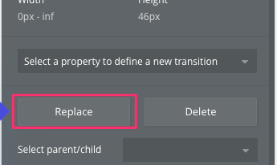

---

- This feature changes the type of the selected element.
- This time, we'll replace this Text element with a Link element.
- Select "Link" from the `New element type` list and click REPLACE.


---

- This replaces the element type with Link
- However, the `Style` and `Conditional` settings from the original element remain, so we'll modify those next

---

- First, change `Style` to a link
- From the element edit popup, select "Link Light Primary" for `Style`


---

- Change the string content to "Pet Register"
- Set the destination to "pet_register"


---

- Changing the Style also removed the contents of `Conditional`
- If it matches the capture, it's OK


---

- That completes the setup of the link to the pet registration screen.


---

#### Controlling Login/Logout Buttons Based on Login Status

- Preparing the login and logout buttons


---

There are five things to do here:

1. Copy the Sign Up button and prepare a Log In button
2. Display the Log In button only when the user is not logged in
3. Clicking the Log In button redirects to the login screen (login)
4. Change the Sign Up button to a Log Out button and display it only when the user is logged in
5. Clicking the Log Out button logs the user out and redirects to the login screen (index)

Let's get started right away. :muscle:

---

#### 1. Copy the Sign up button and prepare a Log in button

- Right-click "Button Sign up" in the left menu "Elements Tree" under the Design tab and select `Copy`


---

- Right-click "Button Sign up" again and select `Paste`.


---

- I think there are now two "Sign Up" buttons, so select the top element.


---

- The advanced settings dialog is displayed in the right panel, so first change the element name to `Button Log in`
- From the Appearance tab, change the Label (button name) to `Log in`


---

- To make the Sign up button and Log in button easier to distinguish, change the background color of the Sign up button appropriately.


---

#### 2. Display the login button only when the user is not logged in

- The control logic is as follows:
  - Keep the login button hidden
  - Using a Conditional rule, display the login button only if the current user is not logged in

---

- First, display the edit dialog for the login button
- On the Layout tab, uncheck `This element is visible on page load`
- This controls that the element will not be displayed when the page loads


---

- Next, we'll implement login status-based control
- Click `Define another condition` in the Conditional tab
- Let's set the condition for "When" to "The current user is not logged in"


---

- That's the idea, I guess.
- `Current User is logged out`


---

- Then, select the action to perform when the condition is met in `Select a property to change when true`
- Do you know what to select? :thinking:

---

- The answer is `This element is visible`
- Select this and check the box to confirm.


---

- The following conditions are now prepared:
  - The login button remains hidden
  - Using a Conditional condition, display the login button only if the current user is logged out


---

#### 3. Pressing the login button takes you to the login screen (index)

- Next, set up the workflow so that pressing the "Log in" button takes you to the login screen
- Since it's just a simple screen transition, everyone should try setting it up!

# :hourglass_flowing_sand:
# :hourglass:

---

- Set the workflow to Go to page
- Select "login" as the Destination, which is the login screen, and you're all set


---

- That completes the login button controls.
- Next, let's move on to the logout button controls.

---

#### 4. Change the sign-up button to a logout button and display it only when logged in

- First, change the label of the "Sign up" button to "Log out"


---

- The display/hide control works almost the same as the login button we just covered:
  - Keep the logout button hidden
  - Use a Conditional rule to display the login button only if the current user is logged in

- Let's configure it based on what we just covered.

# :hourglass_flowing_sand:
# :hourglass:

---

- First, display the edit dialog for the login button
- On the Layout tab, uncheck `This element is visible on page load`
- This controls that the element will not be displayed when the page loads

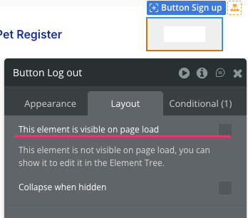

---

- And the Conditional settings look like this:
- The condition for When is `Current User is logged in`
- This prepares the following states:
  - Hide the logout button
  - Display the logout button if the current user is logged in, based on the Conditional setting


---

- Actually, there's one more place where we set the same Conditional condition to control whether an element is displayed only when the current user is logged in.
- Can you spot it? :thinking:

---

- This is the link for the "Pet Register" you added first
- Pet data is associated with the currently logged-in user
- Therefore, set a Conditional on the "Pet Register" link so it only allows navigation to the pet registration screen when logged in

---

- It's the same control as the logout button from earlier, so you understand, right? :smile:

---

- It's like this. :+1:


---

#### 5. Pressing the logout button will log you out and redirect you to the login screen (index).

- Configure the workflow for when the "Log out" button is pressed last.
- Let's all try configuring this first!

---

#### Hint :bulb:

- The workflow hint for logging out is one of the actions within "Account".

# :hourglass_flowing_sand:
# :hourglass:


---

- The action to log the user out is "Log the user out" under "Account".


---

- Then set the screen transition action, and you're all set.


---

- This completes the configuration for the header component.


---

What I Did

- Added a link to the pet registration screen
- Controlled the Login/Logout buttons based on login status
  1. Copied the Sign Up button to create a Log In button
  2. Display the Login button only when not logged in
  3. Clicking the Login button redirects to the login screen (login)
  4. Change the Sign Up button to a Logout button and display it only when logged in
  5. Clicking the Logout button logs out the user and redirects to the login screen (index)

---

By the way...

- You probably won't see the three elements we just set up in your header components
- This is because they were set to be hidden by default in the settings, but there's a way to display them even in that state


---

- Open the `Elements tree` from the left panel, then click "Collapse all" at the far right labeled "Element tree".


---

- All elements currently placed within the screen (or shared component) will be displayed in a tree structure.
- This display order is meaningful: elements shown lower in the tree correspond to those displayed at the front of the screen.

---

- The elements displayed here are all elements contained within the currently displayed screen (common component).
- The display order also has meaning; the elements displayed lower down are those displayed at the very front on the screen.


---

- And within that, under the "Group Links" section toward the bottom, you should see the following three elements you were just working with displayed.
  - Button Pet Register
  - Button Log in
  - Button Log out


---

- The eye icon 👁️ to the right of each of these three elements
- This has an ON and OFF state, with ON displayed on the right panel and OFF hidden from the right panel


---

- For the three elements you just manipulated, turning this "eye" icon OFF and then back ON will also display the buttons on the right panel.
- Note that this controls the display/hide state on the right panel only and does not affect the display/hide state within the actual application.


---

- Finally, to match the current header component's width to the screen width, select the following element from the `Elements tree` and change the `Width` or `W` value to "1080" in the "Layout" tab.

---

- The "header" itself, which is a common component


---

- "Group Header"


---

If changing the `Width` causes the "Pet Register" link or login button to disappear, you should be able to make them visible again by following the same steps as before: click the eye icon next to the button or other element in the `Elements tree` to turn its visibility ON.

---

### Let's integrate it into each screen

- Now that the header component is ready, let's start by integrating it into the pet list screen


---

- Open "pet_list" and delete the link for the "PET REGISTER" you placed first.


---

- Click "header" within `Reusable elements` in the left panel and drag it to the top of the right panel
- Place it at the very top of the screen


---

Let's preview it then 🙋‍♀️

---

#### When logged in

- The pet registration link is displayed
- The logout button is displayed
- Pressing the logout button redirects to the Log in screen


---

#### When logged out

- The pet registration link is not displayed
- The login button is displayed
- Pressing the login button redirects to the Log in screen

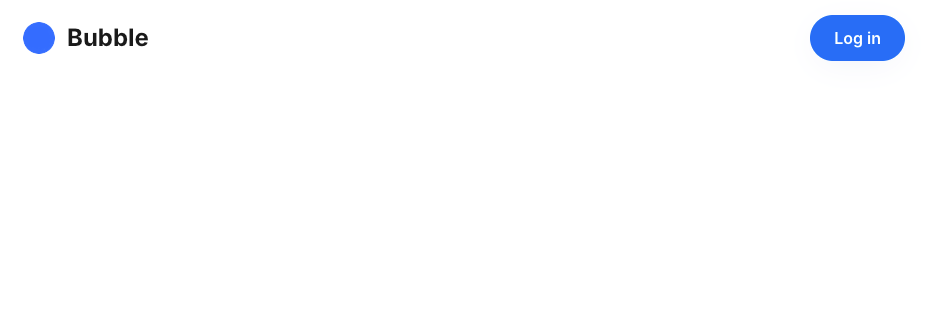

---

- If there are no issues, let's integrate the remaining screens in the same way.
  - Pet Registration Screen
  - Pet Details Screen

Let's Try!! :fire:

---

# :hourglass_flowing_sand:
# :hourglass_flowing_sand:
# :hourglass_flowing_sand:
# :hourglass:
# :hourglass:

---

- Just to be safe, preview each screen to make sure the common header displays correctly!

---

#### Pet Registration Screen


---

#### Pet Details Screen


---

##### Exercise 5

Let's try displaying different links on the pet registration screen

- If you have time, try configuring the pet registration screen to hide the "Pet Register" link in the header.

---

- Hint :bulb:
  - "Current page name"
  - The page name for the pet registration screen is "pet_register".


---


##### Exercise 6

Create a navigation path from the detail screen to the update screen and implement the update functionality.


---

The key points are as shown in the following sheet! Please give it a try!

- Since the update screen has almost the same screen elements as the registration screen, let's clone `pet_register` and create `pet_update`.
- On the registration screen, each input element (like name or birthday) was empty. However, on the update screen, we need to set the values of the already registered data at the time the screen is displayed.
- There are appropriate fields in the dialog for each input element. Specify the initial values there.
  - Hint:bulb: Insert dynamic data
  - Hint:bulb: Initial content

---

- Regarding the behavior when pressing the update button: during new registration it was `Data(Thing)`'s `Create a new thing...`, but this time it's an update, right?
  - Speaking of updates, change... Oh, looks like there's a fitting action for that :yum:
- Finally, when transitioning from the details screen to the update screen, we need to pass over the pet information displayed on the details screen. This is what we learned in today's lecture!
  - Hint:bulb: Data to send

---

##### Exercise 7

Let's build a pet weight management feature

- Enable tracking of multiple daily weights for a single pet and display the weight trend as a graph

---

Here are the key points! Give it a try!

- Create a new table named PetWeight
  - What fields might be needed? 🤔
    - Weight
    - Date weighed
    - Association with the original pet
    - Anything else?

- What elements are needed for the weight management screen?
  - A component to input weight information (weight and measurement date)
  - A weight graph

---

##### Exercise 8

Let's always redirect to the login screen when not logged in

- You wouldn't want users to access any screen with a header component unless they're logged in, right?
- So, let's set it up so that if a user navigates to a screen with a header component while not logged in, they're automatically redirected to the login screen (index).

---

- Hint :bulb:
  - Instead of setting workflows for each screen where the header component is placed, configure the workflow directly on the header component itself.
  - The configuration is simple:
  - When: If the current user is not logged in, "Go to page index"

- 次のページに答え（設定内容）を書いています！

---

- For header components
  - When: User is logged out
  - Go to page login


----

## Integrating with External Systems

- In this chapter, we will build the AI pet advisor functionality using ChatGPT
- We will use the API provided by OpenAI to integrate with ChatGPT


---

### What is an API?

- API: Application Programming Interface
- A method for software or applications to communicate with other software or services
- Through an API, applications can share data, expose other applications' functionality, and utilize it


---

### Preparing for API Integration in Bubble

- Bubble provides convenient plugins that make it easy to connect to APIs
- Select Plugins from the left menu and click "Add plugins" in the top-right corner


---

- A subwindow for searching for plugins to install will appear. Enter "API" and install the plugin named `API Connector`.


---

- Close the subwindow. If `API Connector` appears in the Installed Plugins section of the left panel, you're good to go.


---

- This plugin connects Bubble apps to publicly available APIs, enabling communication between Bubble and the data behind those APIs.
- Some Bubble plugins specialize in specific APIs, offering simpler configuration than this general-purpose API Connector.
- This guide will use the basic `API Connector` plugin to integrate ChatGPT API functionality.

---

### Preparing for API Integration with ChatGPT (OpenAI)

- To use OpenAI's API, you must create an OpenAI account via the following screen, register a payment method, and generate an API key:
  https://platform.openai.com/
- We'll skip those steps this time. I'll share a pre-prepared API key in Slack, so let's use that instead.
- **However, please be careful not to share this key outside this context or overuse it even here.**
  - It could cause your billing to skyrocket 😅

---

#### Reference URLs

- Documentation
  https://platform.openai.com/docs/overview
- API Reference
  https://platform.openai.com/docs/api-reference/introduction
- Pricing
  https://openai.com/api/pricing/
- Admin Panel
  https://platform.openai.com/settings/organization/projects

---

- Now let's proceed with the setup to use the ChatGPT API
- In the Plugins tab, select "API Connector" from the Installed Plugins list
- The plugin overview is displayed in the right panel. Click "Add another API" to begin configuring a new API integration


---

- Clicking "Add another API" displays the API configuration panel shown below
- We'll go through a brief explanation and configuration for each item


---

1. API Name: The group name for this API integration
  - In this case: `ChatGPT`

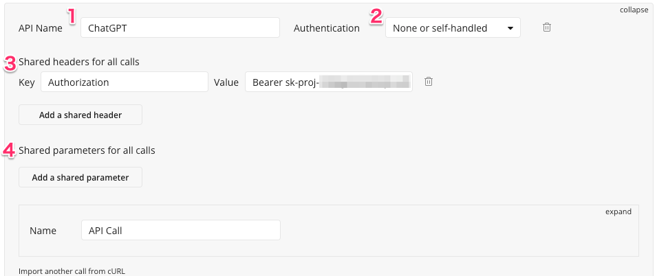

---

2. Authentication: Common authentication method used by APIs under this group
  - This time: `None or self-handled`


---

3. Shared headers for all calls: Common header information specified for all APIs under this group
  - This time, we will configure the settings required for authentication with the ChatGPT API.


---

- Click `Add a shared head` to display the Key/Value input fields, then enter as follows:
  - "Key": `Authorization`
  - "Value": `Bearer` + (space) + the API key shared in advance via Slack


---

4. Shared parameters for all calls: Common parameter information specified for all APIs under this group
  - None specified this time


---

- Next, we'll configure the specific API settings for this group (ChatGPT).
- On the previous screen, click the "expand" link to the right of the block labeled "API Call".
- This will display the specific API configuration options, which I'll briefly explain.


---

1. Name: Specific API name
  - Enter `chat/completions` this time


---

2. Method: HTTP method used for connection
  - Select `POST` this time


---

3. Path: Specific API URL
  - Enter the following this time:
    https://api.openai.com/v1/chat/completions`


---

4. Body: Request body
  - This time, enter the content described later


---

```json
{
  "model": "gpt-4.1-mini",
  "messages": [
    {
      "role": "developer",
      "content": "You are a helpful assistant."
    },
    {
      "role": "user",
      "content": "Hello!"
    }
  ]
}
```

- This is the content of the sample request described in the ChatGPT API documentation.
  https://platform.openai.com/docs/api-reference/chat/create

---

- Once everything is entered, it will appear as follows:


---

- After completing the setup, verify that the configuration is correct
- Click the "Initialize call" button located at the bottom of the `chat/completions` API
- Upon success, a subwindow titled "Returned values - chat/completions" will open


---

- This displays the results (response) information from actually executing the API we set up this time.
- In Bubble's "API Connector," we send the request like this, parse the received results, and configure them for easy handling within Bubble.


---

For brevity, I'll omit the details, but the key points are the following three:

- The section labeled `choices (list)` represents the list where the response messages are stored.
- This indicates that its type is `chat/completions choice`.
- The response content is referred to as `message content`.

Reference: Chat Completion Object Reference
https://platform.openai.com/docs/api-reference/chat/object

---

- For fields you don't need to reference, select `Ignore field` from the dropdown to avoid confusion.
- This ensures the field won't appear in the options when handling it as dynamic data.
- Once configured, click "SAVE" to save your settings.


---

### Next, specify the request body.

Requests are written in a structured format called JSON. Each field has the following meaning:

---

- `model`: The model to use. GPT offers multiple models differing in size and capability.
  This time, we'll test using the lightweight and affordable `gpt-4.1-mini`.
- `messages`: The set of messages provided to GPT as context.
  Broadly speaking, GPT is a language model exceptionally skilled at generating coherent text continuations. By specifying the source context as a set of `role` (role) and `content` (content) pairs and concatenating them, it returns a continuation (response) aligned with that context.

---

The context provided corresponds to instructions for the chat, hence it is called a prompt.

Reference: create chat completion reference
https://platform.openai.com/docs/api-reference/chat/create

---

- This time, we'll integrate a feature that provides advice based on the pet's registration details and the owner's consultation message.
- To embed content into the Body later when calling the API from Bubble, wrap it in `< >` tags and name it, like `<name>`.
- The details are listed on the next page.

---

※The following content includes line breaks for readability in the content section and will not function if pasted as-is.
※Therefore, please paste the JSON listed on the next page into the Body field.

```json
{
  "model": "gpt-4.1-mini",
  "messages": [
    {
      "role": "system",
      "content": "ペットの飼育アドバイザーとして回答してください。
      ペットの名前、生年月日、カテゴリーが飼い主であるユーザーから伝えられます。
      また、さらに飼い主からペットに対する相談内容も伝えられます。
      それらに基づいて、ペットの飼育へのアドバイスを回答してください。
      なお、回答の冒頭で確認のために、与えられた情報である名前、生年月日、カテゴリー、相談内容に触れるようにしてください。"
    },
    {
      "role": "user",
      "content": "ペットの名前：<name>、ペットの生年月日：<birthday>、
      ペットのカテゴリー：<category>、相談内容：<content>"
    }
  ]
}
```

---

```json
{
  "model": "gpt-4.1-mini",
  "messages": [
    {
      "role": "system",
      "content": "ペットの飼育アドバイザーとして回答してください。ペットの名前、生年月日、カテゴリーが飼い主であるユーザーから伝えられます。また、さらに飼い主からペットに対する相談内容も伝えられます。それらに基づいて、ペットの飼育へのアドバイスを回答してください。なお、回答の冒頭で確認のために、与えられた情報である名前、生年月日、カテゴリー、相談内容に触れるようにしてください。"
    },
    {
      "role": "user",
      "content": "ペットの名前：<name>、ペットの生年月日：<birthday>、ペットのカテゴリー：<category>、相談内容：<content>"
    }
  ]
}
```

---

- Items enclosed in `<>` will appear below the Body area
- Uncheck only the "Private" box
  - This allows values to be set dynamically when calling the API


---

## Let's integrate the API into the screen

- Now that the API is ready, we'll create the screen to actually integrate it

---

- Create a new screen from the top-left menu: `+New` → Web page
  - "Page name": `pet_consult`
  - "Clone from": `pet_list`
    - To reuse it as a screen with the header component already set
- Delete only the Repeating Group elements from the pet list display


---

- To ensure it's available for subsequent tasks, we'll specify `Pet` for the "Type of content" field on the screen.


---

- GPT responses can be lengthy, so ensure your screen has sufficient vertical space to display them fully.
  - Open the global menu, navigate to the Layout tab, and set `Height` to 1500.


---

Next, let's arrange the elements as shown in the image:
- Text explaining the screen and its functions
- Input form for entering consultation messages
- Submit button


---

- Next, we'll place elements to display the responses returned by ChatGPT.
- To receive responses, you must use container elements like `Group` or `RepeatingGroup` that allow defining the `type`.
- Since we don't need repeated displays this time, let's place a `Group`.


---

- Set `H` to `1000` to ensure long answers are fully displayed


---

- Specify `chat/completions choice`, which you defined earlier in the API settings, for "Type of content".


---

- Next, place a Text element inside the Group you just created so the response text can be displayed.
- Set it up as shown on the right so it fills the entire Group's size.

- Key points:
  - Do not specify width or height.
  - Height should match the content.


---

- The text content is the `message content` included in the API response, so define it as Dynamic data.


---

- It looks something like this, right?


---

### Setting up the workflow

- We'll set up the workflow for the Send button
- What we want to do is display data retrieved from ChatGPT in the elements
- Which action is it? :thinking:

# :hourglass_flowing_sand:
# :hourglass:

---

- The answer is `Display data in a group/popup` under `Element Actions`.


---

In the Display Data section, configure settings to call the API based on the screen content and set the response.

---

- Specify `Group chat/completion choice` for "Element"
  - This is the Group you placed earlier


---

- Specify `Get data from an external API` under "Data to display"
  - This specifies that data will be retrieved from an external API


---

The API call submenu will appear, allowing you to configure further settings.
- Specify the previously configured `ChatGPT - chat/completions` for "API provider".

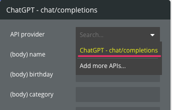

---

Next, we'll set the parameters required for the API call.
- You know how to specify the required field names, right? :wink:

---

- Configure as follows:


---

- Return to the "Display data" menu and specify `'s choices :first item`
- ChatGPT is structured to retrieve multiple responses since it can be used to select from multiple answers. However, for this use case, we only need one response, so we always specify the first one.


---

Finally, add a link from the pet details screen to navigate to this screen.
You should be able to set this up now!


---

### Let's preview it out!


---

This enables integration between Bubble and ChatGPT via the API.

LLMs like ChatGPT can perform various actions with well-crafted prompts,
so combining them effectively with no-code tools lets you easily build powerful features.

You can also store retrieved responses in a database for history reference
or continue conversations.

It's fun to quickly bring all sorts of ideas to life, so give it a try :cat::dog::rabbit:

---

## Introduction to AI Features

- Riding the wave of generative AI, Bubble now incorporates AI-powered automatic application generation.
- While this is just an introduction, let's see what kind of features are available and what kind of outputs they produce.

---

- First, I'll try building an app using AI.
  - Since it takes time, I'll get started on it first.

---

- Access the URL below to navigate to the list of apps you're creating
  - https://bubble.io/home/projects
- Click `Create with AI` in the top-right corner
- A small menu will appear; click "Web app"


---

- You'll be asked if you want to upgrade your plan, but ignore that and click "Start with basic features."


---

- Enter the outline of the app you want AI to create as a prompt.


---

Enter the following content into the prompt and click Start Generation

```
This pet management app allows you to register your pet's name, category, birthday, gender, and image.
Pets can be managed individually per user, and records related to pet care can also be saved.
It features a simple, minimalist design with blue and silver as the base colors.
```


---

- Then, I begin by understanding the prompt's content and considering what set of features is needed.


---

- After a moment, the app title and feature overview based on your prompt will appear.
- You can still refine (add to) the prompt on this screen, but since the content seems fine for now, click `Generate` to start creating the app.


---

- Then, the app creation will begin, so please wait a moment.


---

### プロンプトガイド

- Here, we'll briefly explain guidelines for what to include in your prompt.
- Bubble emphasizes that including the following points is crucial:
  - App Type and Purpose – What kind of app is it, and what problem does it solve?
  - Target Users – Who is this app for?
  - Core Functionality – What must users be able to do?
  - Visual Style – Reference materials for colors, mood, and design that define the look and feel

---

- https://manual.bubble.io/help-guides/ai/bubbles-ai-app-generator
- There's also a guide here, so if you're interested, please take a look.

---

- Here is the completed app.


---

- By the way, even with the same prompt, the resulting apps still turn out slightly different, and there are quite a few features that don't work.


---

- That said, building an app from scratch in this state would be quite challenging, so using this functionality as a foundation might be a viable approach.
- That said, how difficult it is to investigate and resolve issues when features aren't working depends on the accuracy of the AI's output at that time, so it's hard to say.
- Therefore, even when using it as a foundation, avoiding overly complex features might ultimately help keep the total cost down.

---

##### Exercise 9

Let's build a new feature using what we learned today

Feel free to add any feature using the functionality we covered today
Once you're done, share the login screen URL in Slack for everyone to see

---

##### Announcing Exercise 9 Results

(If you have time)

Why not introduce the screens and features you created during the exercise? :smile: ?

---

## Tips for Using Bubble in Team Development

Here are some tips for using Bubble in team development :memo:

---

- To co-edit a single app with team members...
  - Set up one account for the team, then everyone logs in and shares that account
  - Bubble does have official co-editing features, but... 💸💸💸
- When multiple people are co-editing, avoid editing the same element simultaneously
  - Later edits will overwrite earlier ones
  - We recommend dividing tasks by screen to minimize such conflicts
- There are no other particular points to note

---

## Summary

- Today's lecture covered Bubble, a no-code tool, starting with its basics and progressing to designing screens and integrating them with databases.
- We also experienced how integrating with APIs significantly expands Bubble's capabilities.
- Some teams at the hackathon may use external APIs; when they do, apply what we learned today to implement API integration.

---

# That's all!
# Great work today!
